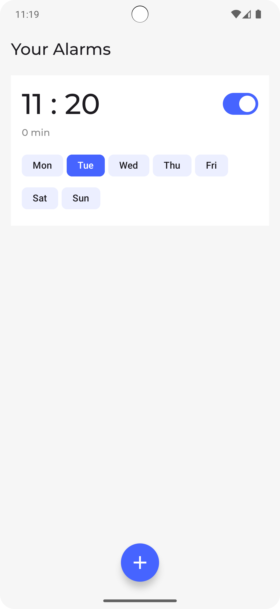
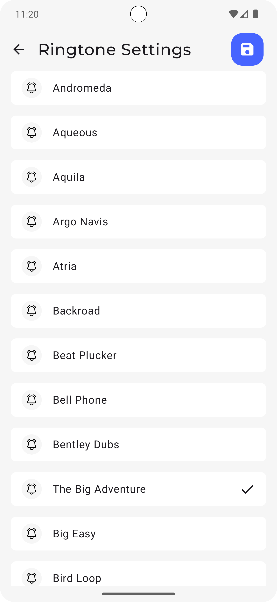
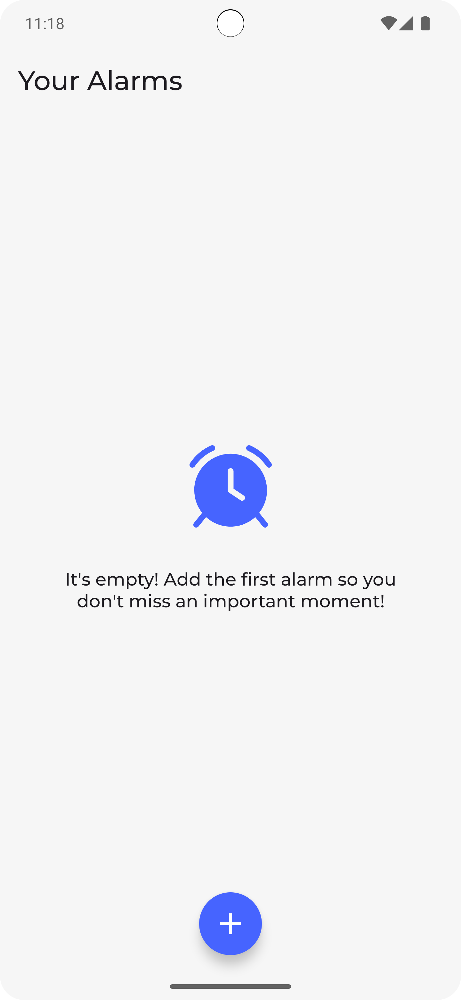
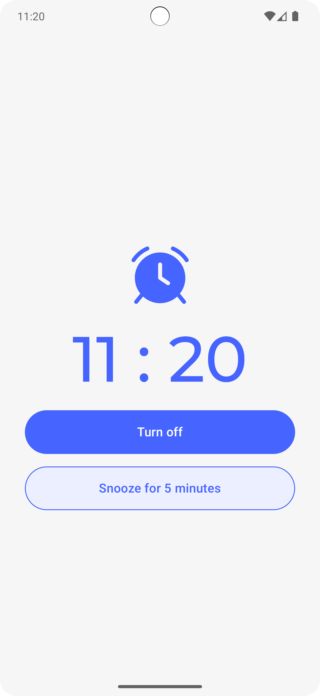
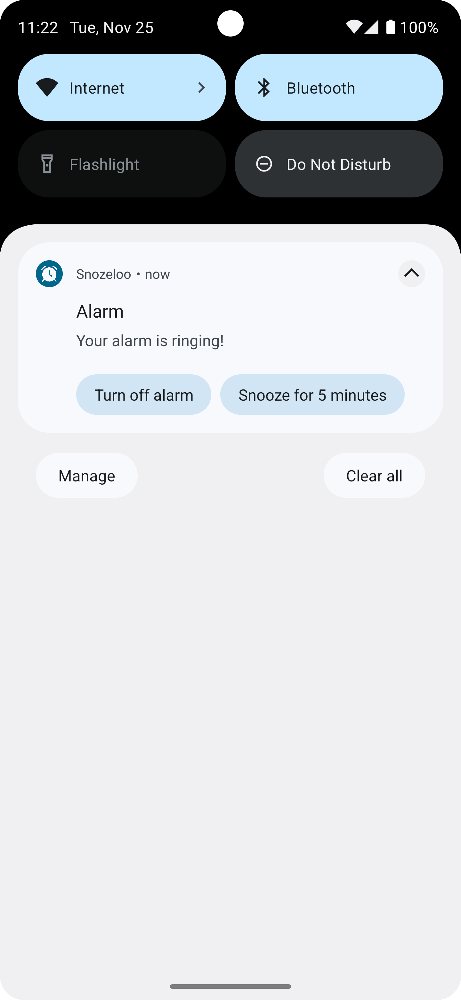

# Snozeloo

Snozeloo, güne zinde ve keyifli başlamanız için tasarlanmış modern bir Android alarm uygulamasıdır. Kullanıcı dostu arayüzü ve gelişmiş özellikleriyle alarm deneyiminizi kişiselleştirmenize olanak tanır.

## ✨ Özellikler

*   **Modern ve Sade Arayüz:** Jetpack Compose ile oluşturulmuş, kullanımı kolay ve göze hitap eden bir arayüz.
*   **Kişiselleştirilebilir Alarmlar:** Alarmlarınızı tekrarlama seçenekleri, özel zil sesleri ve daha fazlasıyla dilediğiniz gibi ayarlayın.
*   **Erteleme ve Kapatma:** Sabahları size en uygun şekilde uyanmak için erteleme ve kapatma seçenekleri.
*   **Veritabanı Desteği:** Alarmlarınız, Room veritabanı sayesinde güvenli bir şekilde cihazınızda saklanır.
*   **Modern Teknoloji Mimarisi:** Hilt, Kotlin Coroutines ve Flow gibi modern Android geliştirme araçları kullanılarak oluşturulmuştur.

## 🛠️ Teknoloji ve Mimarisi

Snozeloo, aşağıdaki modern teknolojiler ve en iyi pratikler kullanılarak geliştirilmiştir:

*   **[Kotlin](https://kotlinlang.org/)**: Ana programlama dili.
*   **[Jetpack Compose](https://developer.android.com/jetpack/compose)**: Modern ve deklaratif bir UI aracı.
*   **[Hilt](https://dagger.dev/hilt/)**: Bağımlılık enjeksiyonu için.
*   **[Room](https://developer.android.com/training/data-storage/room)**: Yerel veritabanı çözümü.
*   **[Jetpack Navigation](https://developer.android.com/guide/navigation)**: Uygulama içi navigasyon yönetimi.
*   **[Kotlinx Serialization](https://github.com/Kotlin/kotlinx.serialization)**: JSON verilerini ayrıştırma ve serileştirme.
*   **[Coroutines & Flow](https://kotlinlang.org/docs/coroutines-overview.html)**: Asenkron işlemler ve reaktif programlama için.

## 📸 Ekran Görüntüleri

| Alarmlar Ekranı | Alarm Detayı | Zil Sesi Ayarları |
| :---: |:---:|:---:|
|  |  |  |

|                      Ana Ekran                       | Alarm Çalma Ekranı | Alarm Bildirimi |
|:----------------------------------------------------:|:---:|:---:|
|  |  |  |
